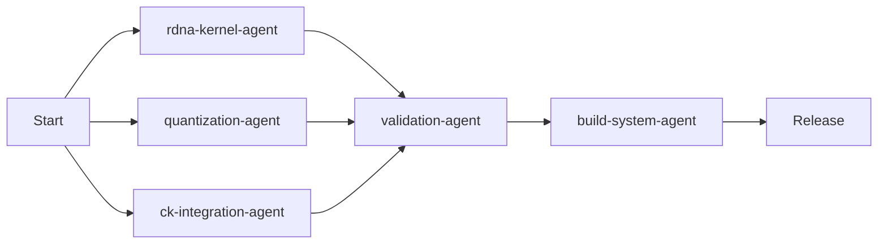

# SageAttention3 RDNA Sub-Agents Summary

## ✅ All 5 Sub-Agents Created Successfully!

### Agent Overview

| Agent | Role | Status | Location |
|-------|------|--------|----------|
| **rdna-kernel-agent** | HIP kernel development for RDNA3.5/4 | ✅ Created | `.claude/agents/rdna-kernel-agent.md` |
| **quantization-agent** | FP4/INT4/FP8 quantization strategies | ✅ Created | `.claude/agents/quantization-agent.md` |
| **ck-integration-agent** | AMD Composable Kernel integration | ✅ Created | `.claude/agents/ck-integration-agent.md` |
| **validation-agent** | Testing and benchmarking | ✅ Created | `.claude/agents/validation-agent.md` |
| **build-system-agent** | CMake/Python packaging | ✅ Created | `.claude/agents/build-system-agent.md` |

## Agent Capabilities

### 1. **rdna-kernel-agent**
- **Focus**: HIP kernel implementation
- **Key Skills**:
  - CUDA to HIP conversion
  - WMMA optimization for RDNA
  - Memory access pattern optimization
  - Wave/warp management
- **Tools**: hipcc.exe, amdclang++.exe from .venv

### 2. **quantization-agent**
- **Focus**: Memory-efficient quantization
- **Key Skills**:
  - INT4 emulation for RDNA3.5
  - Native FP4 for RDNA4
  - Block-scaled quantization
  - Accuracy preservation techniques
- **Deliverable**: 75% memory reduction with <1% accuracy loss

### 3. **ck-integration-agent**
- **Focus**: Composable Kernel templates
- **Key Skills**:
  - CK template configuration
  - CK-Tile for FlashAttention
  - Forward-pass attention optimization
  - WMMA mapping to CK operations
- **Advantage**: Leverages existing AMD optimizations

### 4. **validation-agent**
- **Focus**: Comprehensive testing
- **Key Skills**:
  - Unit/integration testing
  - Accuracy validation
  - Performance benchmarking
  - Memory profiling
- **Metrics**: TFLOPS, memory usage, accuracy vs baseline

### 5. **build-system-agent**
- **Focus**: Build infrastructure
- **Key Skills**:
  - CMake for HIP compilation
  - Python packaging with setuptools
  - Multi-architecture builds (gfx1151, gfx1200)
  - CI/CD integration
- **Output**: pip-installable package

## Agent Workflow

### Parallel Development Tracks



### Communication Protocol

1. **Daily Sync Points**
   - Kernel implementation status (rdna-kernel)
   - Quantization accuracy metrics (quantization)
   - CK template selection (ck-integration)
   - Test results (validation)
   - Build status (build-system)

2. **Shared Resources**
   - Common header files in `hip/include/`
   - Test tensors in `tests/data/`
   - Benchmark results in `benchmarks/results/`

3. **Integration Points**
   - Kernel ↔ Quantization: Data type interfaces
   - Kernel ↔ CK: Template instantiation
   - All → Validation: Test coverage
   - All → Build: Compilation dependencies

## Next Steps for Each Agent

### Immediate Tasks (Week 1)

1. **rdna-kernel-agent**:
   - Create basic attention forward kernel
   - Implement WMMA operations
   - Test on gfx1151

2. **quantization-agent**:
   - Implement INT4 packing/unpacking
   - Create block scaling functions
   - Validate quantization accuracy

3. **ck-integration-agent**:
   - Clone and build CK library
   - Create attention template instance
   - Verify CK works with gfx1151

4. **validation-agent**:
   - Set up pytest framework
   - Create basic accuracy tests
   - Implement benchmark suite

5. **build-system-agent**:
   - Create CMakeLists.txt
   - Set up Python package structure
   - Test compilation with .venv tools

## Usage Example

To work with a specific agent:

```bash
# Example: Work on kernel development
claude-code "As rdna-kernel-agent, implement the basic attention forward kernel for gfx1151"

# Example: Test quantization
claude-code "As quantization-agent, implement and test INT4 quantization for RDNA3.5"

# Example: Run validation
claude-code "As validation-agent, create and run accuracy tests for the attention kernel"
```

## Success Metrics

Each agent has clear success criteria:

| Agent | Success Metric | Target |
|-------|---------------|---------|
| rdna-kernel | WMMA utilization | >50% |
| quantization | Memory reduction | >70% |
| ck-integration | CK template working | ✓ |
| validation | Test coverage | >90% |
| build-system | Package builds | ✓ |

## Agent Files Created

All agent instruction files are located in:
```
.claude/agents/
├── rdna-kernel-agent.md      (2.5 KB)
├── quantization-agent.md     (4.1 KB)
├── ck-integration-agent.md   (4.8 KB)
├── validation-agent.md       (5.2 KB)
├── build-system-agent.md     (6.3 KB)
└── agents-summary.md         (this file)
```

The sub-agents are now ready to begin parallel development of the SageAttention3 RDNA port!